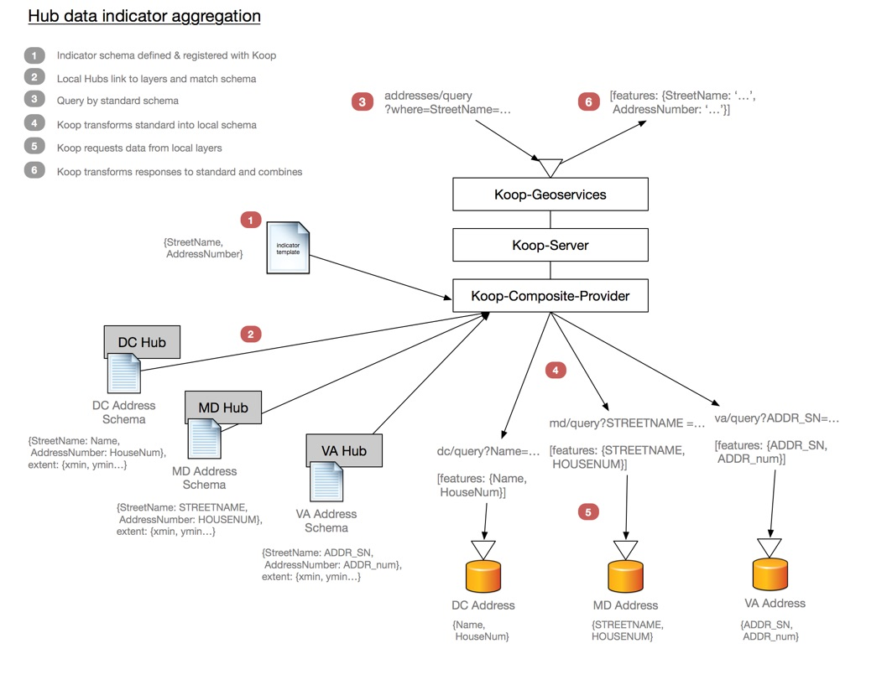

[](https://travis-ci.org/koopjs/koop-provider-sample) [](https://greenkeeper.io/)


# Koop Composite Provider

Dynamic, composite aggregation of features across multiple servers with unique schemas into a single, virtual layer. 

Combining data from different government agencies is often difficult because of varying data schemas (field attributes) and also the need to combine results into a single collection of features. For example, retrieving all of the address points from three counties into a single county layer with consitent field schema. 

Koop Composite supports these needs through registration of a new _indicator_ with a schema, and then registering new sources for that indicator, as well as how their data schema align with the _indicator schema_. Then applications can query the virtual _indicator layer_ and Koop Composite automatically transforms any query filters to the local schemas, transforms the results into the indicator schema and combines the multiple responses into a single collection. 




## Install

Koop Composite requires Redis for storing the _indicators_ and _schema_. 

Install Redis and then start with 
- `redis-server`. 

Then install & run Koop Composite.

Run server:
- `npm install`
- `npm start`

Tests:
- `npm test`

## Composite API 

There are multiple steps to creating & using a Composite provider:

1. Create a new _indicator_ that includes the required schema
2. Register a new _source_ from existing server layers, including their spatial extent and schema matching to the _indicator_ schema
3. Query data from the new virtual layer

You can also unregister _sources_.

See additional examples in [files/](files/).

### Register a new Indicator

`PUT {server}/composite/{indicator_name}`

_Body_

```json
{
  "name": "Intitiative",
  "description": "Hey Now!",
  "indicator_schema": {
    "type": "FeatureCollection",
    "features": [],
    "metadata": {
      "maxRecordCount": 5000,
      "geometryType": "Point",
      "extent": {
        "xmin":-137.889404296875,
        "ymin":11.55487060546875,
        "xmax":-45.604248046875,
        "ymax":57.34588623046875,
        "spatialReference":{
          "wkid":4326
        }
      },
      "idField": "aid",
      "name": "Aggregrated Addresses",
      "description": "proxied by http://koopjs.github.io/",
      "fields": [{
        "name": "state",
        "type": "esriFieldTypeString",
        "alias": "state"
        }, {
          "name": "county",
          "type": "esriFieldTypeString",
          "alias": "county"
        }, {
          "name": "incorporatedmunicipality",
          "type": "esriFieldTypeString",
          "alias": "incorporatedMunicipality"
        }, {
          "name": "unincorporatedmunicipality",
          "type": "esriFieldTypeString",
          "alias": "unincorporatedMunicipality"
        }, {
          "name": "zipcode",
          "type": "esriFieldTypeString",
          "alias": "zipCode"
        }, {
          "name": "streetname",
          "type": "esriFieldTypeString",
          "alias": "streetname"
        }, {
          "name": "addressnumber",
          "type": "esriFieldTypeString",
          "alias": "addressNumber"
        }, {
          "name": "guid",
          "type": "esriFieldTypeString",
          "alias": "guid"
        }, {
          "name": "addresstype",
          "type": "esriFieldTypeString",
          "alias": "addressType"
        }, {
          "name": "addressplacement",
          "type": "esriFieldTypeString",
          "alias": "addressPlacement"
        }, {
          "name": "addresssource",
          "type": "esriFieldTypeString",
          "alias": "addressSource"
        }, {
          "name": "addressauthority",
          "type": "esriFieldTypeString",
          "alias": "addressAuthority"
        }, {
          "name": "datelastupdated",
          "type": "esriFieldTypeDate",
          "alias": "dateLastUpdated"
        }, {
          "name": "sourceservice",
          "type": "esriFieldTypeString",
          "alias": "sourceService"
        }, {
          "name": "aid",
          "type": "esriFieldTypeDouble",
          "alias": "aid"
        }
      ]
    },
    "aggregate_schemas": {}
  },
  "aggregate_schemas": {}
}
```

### Register a new Source

_Body_

`PUT {server}/composite/{indicator_name}/{source_name}`


```json
{
      "url": "https://services7.arcgis.com/BBpPn9wZu2D6eTNY/arcgis/rest/services/ORANGE_COUNTY_WITH_FLDS/FeatureServer/0/query",
      "fieldMap": {
        "state": "State",
        "county": "Add_cnty",
        "incorporatedmunicipality": "MailingCit",
        "unincorpcounty": "Add_uninc",
        "postalcommunityname": "FireDist",
        "zipcode": "ZipCode",
        "streetname": "Name",
        "addressnumber": "HouseNum",
        "guid": "guid",
        "addresstype": "LBCSDesc",
        "addressplacement": "Add_plcmnt",
        "addresssource": "Add_src",
        "addressauthority": "Add_auth",
        "datelastupdated": "EditDate"
    },
    "extent": {
        "xmin": -8825271.4547,
        "ymin": 4280522.407899998,
        "xmax": -8788727.2223,
        "ymax": 4334516.740699999,
        "spatialReference": {
            "wkid": 102100,
            "latestWkid": 3857
        }
    }
}
```

### Query Indicator

`GET {server}/composite/{indicator_name}/FeatureServer/0/query?returnCountOnly=true`

[Example at localhost:3000](localhost:3001/composite/addresses/FeatureServer/0/query?returnCountOnly=true)
